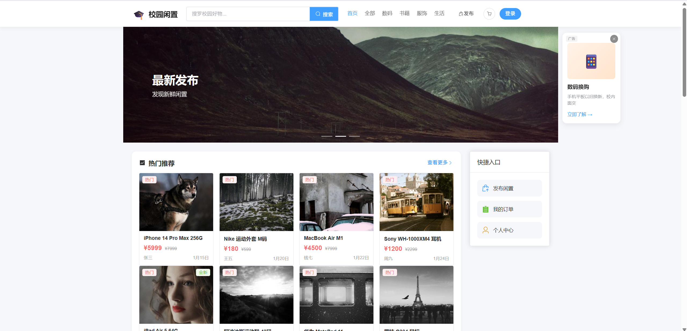
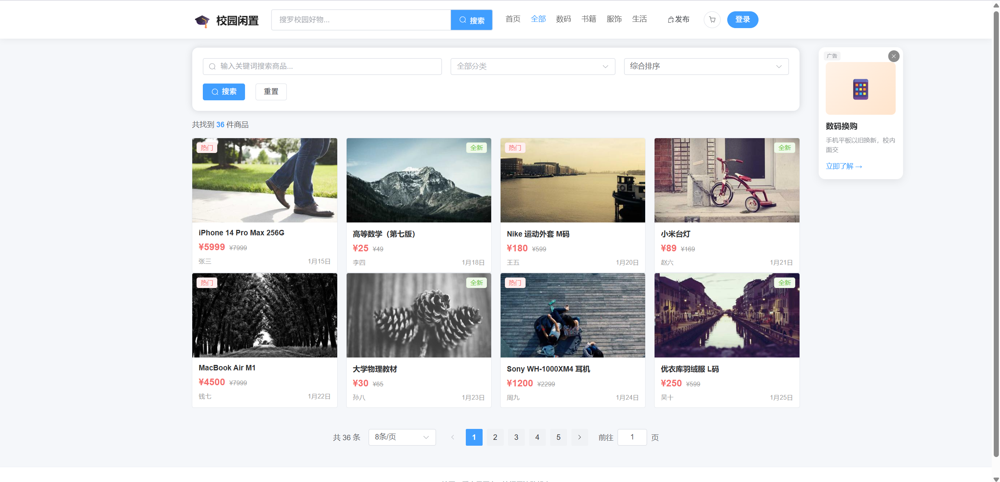
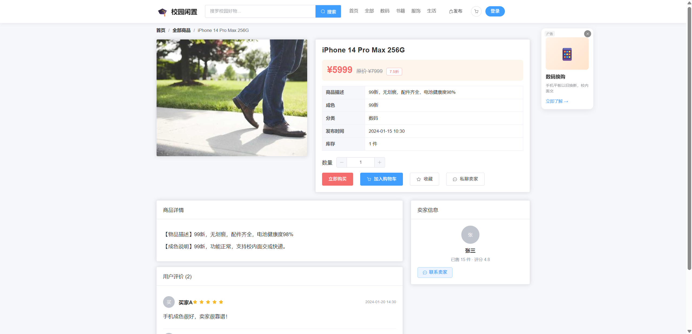
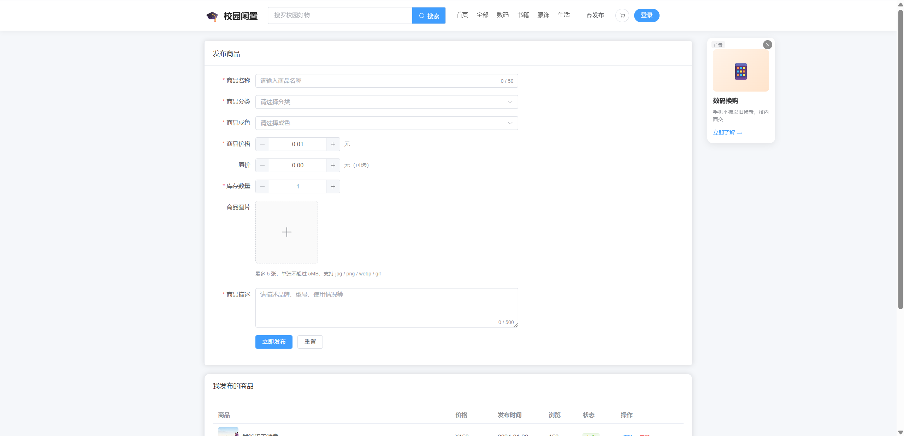
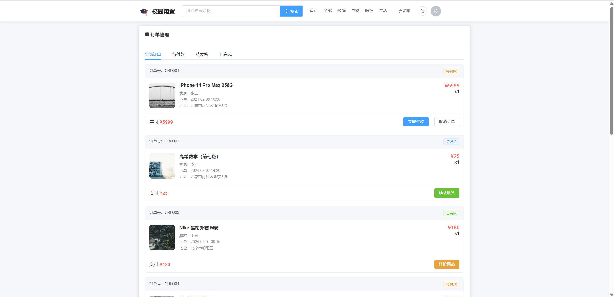
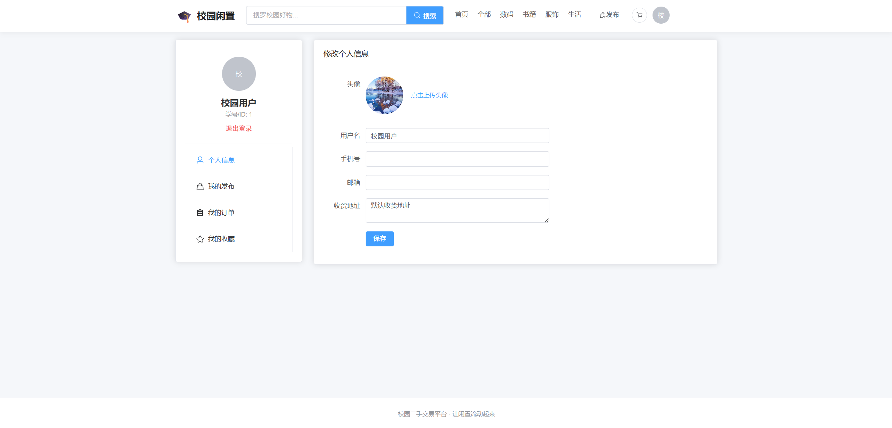

# 校园二手交易平台

一个面向高校学生的二手物品交易平台，让闲置物品流转起来。

## 技术栈

| 技术 | 版本 | 说明 |
|------|------|------|
| Vue 3 | 3.x | 使用组合式API（`<script setup>`） |
| Vite | 5.x | 构建工具 |
| Vue Router | 4.x | 路由管理 |
| Pinia | 2.x | 状态管理 |
| Element Plus | 2.x | UI框架 |
| Axios | 1.x | 对接后端API |


## 项目简介

### 功能概述

- **商品展示与检索**：支持分类浏览（数码、书籍、服饰、生活用品）、关键词搜索、价格/时间排序
- **首页轮播图**：展示热门推荐、最新发布等促销活动
- **商品详情页**：图文详情、成色说明、用户评价、支持收藏和加入购物车
- **发布功能**：上传商品图片、填写描述、设置价格和分类，支持编辑和下架
- **订单管理**：查看订单状态（待付款/待发货/已完成）、确认收货、评价商品
- **个人中心**：管理个人信息、查看我的发布、我的订单、我的收藏

### 核心特性

- **组件封装**：ProductCard（商品卡片）、ProductForm（商品表单）等可复用组件
- **状态管理**：基于 Pinia 实现用户登录状态、购物车、收藏等跨组件数据共享
- **响应式设计**：适配桌面端显示，类似闲鱼的二手商品展示风格
- **代码规范**：清晰的目录结构、合理的注释、规范的变量命名

## 运行指南

### 环境要求

- Node.js >= 16
- pnpm >= 8（推荐）或 npm/yarn

### 安装依赖

```bash
pnpm install
```

### 启动开发服务器

```bash
pnpm dev
```

项目运行后访问 http://localhost:5173/

### 构建生产版本

```bash
pnpm build
```

## 功能截图

### 首页


### 商品列表


### 商品详情


### 发布商品


### 订单管理


### 个人中心


## 项目结构

```
src/
├── api/              # API 接口封装
│   └── index.js      # 接口统一出口（商品、订单、用户、购物车等）
├── components/       # 可复用组件
│   ├── AppLayout.vue       # 页面布局组件（顶部导航、侧边栏）
│   ├── ProductCard.vue      # 商品卡片组件
│   ├── ProductForm.vue      # 商品表单组件（发布/编辑）
│   └── SideAd.vue           # 侧边广告组件
├── router/
│   └── index.js     # 路由配置
├── stores/           # Pinia 状态管理
│   ├── product.js   # 商品相关状态（列表、热门、评价）
│   ├── user.js      # 用户相关状态（登录、收藏、购物车）
│   └── order.js     # 订单相关状态（订单管理、我的发布）
├── styles/           # 独立样式文件（按页面分离）
│   ├── HomeView.css
│   ├── ProductDetailView.css
│   ├── ProductListView.css
│   ├── ProfileView.css
│   ├── OrderView.css
│   └── PublishView.css
├── utils/
│   ├── request.js   # Axios 封装（拦截器、错误处理）
│   └── upload.js     # 图片上传工具
├── views/            # 页面视图
│   ├── HomeView.vue        # 首页（轮播图、热门推荐、最新发布）
│   ├── ProductListView.vue # 商品列表页（搜索、筛选、排序）
│   ├── ProductDetailView.vue # 商品详情页（购买、收藏、私聊）
│   ├── PublishView.vue     # 发布商品页
│   ├── OrderView.vue       # 订单管理页
│   └── ProfileView.vue     # 个人中心页
├── App.vue           # 根组件
├── main.js          # 入口文件
└── style.css         # 全局样式
```

## 开发规范

### 代码风格

- 使用 Vue 3 组合式 API（`<script setup>`）
- 变量命名使用 camelCase
- 组件命名使用 PascalCase
- 文件名使用 PascalCase（视图组件）或 kebab-case（工具函数）

### 注释规范

- API 接口：添加功能说明注释
- 状态管理：添加模块说明和方法注释
- 工具函数：添加 JSDoc 风格注释

## 对接后端

如需对接真实后端接口，请：

1. 修改 `.env` 文件中的 `VITE_API_BASE_URL` 为后端地址
2. 确保后端 API 遵循 `/products`、`/user`、`/orders` 等路径规范

## License

MIT
